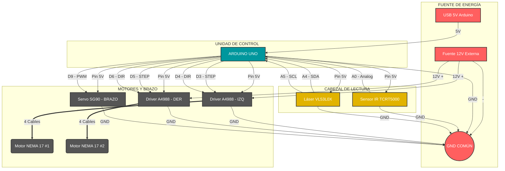

# Documentación Técnica: Máquina de Turing Electromecánica (Implementación Arduino)

## 1\. Introducción

Este documento describe la arquitectura de hardware y software para la construcción física de una Máquina de Turing. El sistema utiliza una cinta física con celdas de memoria mecánicas (sliders), un sistema de tracción por carretes y un cabezal de lectura/escritura híbrido.

El objetivo es trasladar la simulación digital a un modelo físico funcional utilizando la plataforma Arduino.

-----

## 2\. Arquitectura de Hardware: Electrónica

### 2.1. Microcontrolador y Actuadores

| Componente | Función en el Sistema | ¿Por qué se eligió? | Implementación |
| :--- | :--- | :--- | :--- |
| **Arduino UNO** | Cerebro Central | Facilidad de uso, librerías robustas y suficientes pines I/O. | Gestiona la lógica de estados, lectura de sensores y coordinación de motores. |
| **Motores NEMA 17 (x2)** | Tracción de Cinta | Requieren alto torque para mover la masa de la cinta y precisión milimétrica para posicionar las celdas. Los servos continuos no tienen la precisión necesaria. Alternativamente se puede utilizar otro motor paso a paso, pero se optó por este debido a las características mencionadas anteriormente.| Conectados a los ejes de los carretes (Direct Drive o polea). Se controlan mediante drivers **A4988** o **DRV8825**. Se mueven en sincronía para mantener la tensión. |
| **Servo SG90** | Brazo Escritor | Es pequeño, ligero y suficiente para empujar una pieza plástica (slider) de 2 gramos. | Montado en el pilar frontal. Un brazo largo amplifica su movimiento para "golpear" el slider hacia la posición 0 o 1. |
| **Botón** | Cambio de modo | Se eligió para poder conmutar entre suma y resta unaria de forma sencilla. Se podría complementar con una pantalla LED para visualizar el modo pero no es necesario | Montado en cualquier parte de la máquina. |

### 2.2. Sensores (El Cabezal de Lectura)

El sistema no depende de un solo sensor para validar al otro, sino que utiliza **dos tecnologías distintas** para leer dos propiedades físicas diferentes de la cinta simultáneamente. Dado que el material de la cinta y las celdas tienen características específicas, se requiere la **suma de ambos datos** para interpretar el símbolo correctamente.

#### 1. Lectura de Contraste (Sensor IR)
* Este sensor es **"ciego" a la profundidad**, pero altamente sensible al **color** (reflectividad).
* Su única función es diferenciar entre el **Material de la Celda (Naranja u otro color)** y el **Fondo de la Cinta (Negro)**.
* **Propósito:** Esto permite al sistema saber binariamente si el cabezal está posicionado sobre una estructura de memoria válida o en un espacio vacío.
* **Implementación:** Se coloca a **2-3mm** de la superficie de la cinta, apuntando hacia la parte de color negro de la cinta en el hueco entre celdas.

#### 2. Lectura de Topología (Sensor Láser)
* Este sensor es **"ciego" al color**, pero altamente sensible a la **geometría**.
* Su función es medir la distancia física absoluta al objeto más cercano en el eje Z.
* **Propósito:** Distingue topológicamente entre **Pared** (Obstáculo cerca/Slider levantado) y **No Pared** (Fondo lejano/Hueco del slider).
* **Implementación:** Se coloca a **30-50mm** de la superficie de la cinta, mirando hacia abajo, apuntando hacia la parte blanca de la cinta.

-----

## 3\. Arquitectura Mecánica y Materiales

### 3.1. Sistema de Transporte

  * **Carretes (x2):** Actúan como almacenamiento de la cinta infinita. Pueden ser de cualquier material siempre y cuando soporten la cinta correctamente. Idealmente deben estar dentados para mejorar la mecánica paso a paso. Esto se puede hacer de forma casera o bien utilizando engranajes.
  * **Base de Madera:** Provee peso y rigidez. Fundamental para absorber la vibración de los motores NEMA 17, evitando que el sensor láser vibre y dé lecturas erróneas.
  * **Soportes de Carretes:** Torres robustas ancladas a la madera con rodamientos (tipo 608zz) para reducir la fricción del eje.
  * **Cinta Bi-color:** Cinta bi-color que se aprovechará para la escritura de símbolos con el uso de celdas.
  * **Correa GT2 de 6 o 10mm:** Correa dentada que sostiene la cinta y marca los pasos de la máquina. Su uso es opcional, pero altamente recomendado si se busca máximo rendimiento.

### 3.2. Diseño de la Celda de Memoria

Cada celda es un eslabón de la cinta. Dentro tiene una pieza móvil ("slider"). En base a su posición, y gracias a los colores de la cinta se pueden verificar los símbolos para la lectura/escritura (1,0,_).

#### Alternativa A: Fijación Magnética

  * **Concepto:** Se incrustan imanes de neodimio pequeños (2mm) en el slider y en el marco de la celda. Similar a cómo los cubos de rubik magnéticos fijan su posición sin estorbar el movimiento de las manos.
  * **Pros:** Sensación táctil premium ("click"), desgaste nulo, posición perfecta siempre.
  * **Contras:** Costoso (64 celdas = 192+ imanes), complejo de ensamblar (polaridad), peso extra.

#### Alternativa B: Fijación por Retención Mecánica (Detents)

  * **Concepto:** El slider tiene una pequeña protuberancia plástica y el marco tiene dos muescas. Se aprovecha la flexibilidad del plástico (PLA/PETG).
  * **Pros:** Costo cero (solo impresión 3D), ligero, fácil de imprimir.
  * **Contras:** Desgaste con el tiempo (miles de ciclos). Requiere calibrar bien la tolerancia de la impresora 3D.
  * **Implementación:** Se recomienda imprimir una forma de "resorte" en el propio slider plástico para mantener la tensión constante sin fatigar el material.

-----

## 4\. Diagrama de Conexiones

  * **NEMA 17 (Izquierdo):** Pines STEP/DIR -\> 3, 4
  * **NEMA 17 (Derecho):** Pines STEP/DIR -\> 5, 6
  * **Servo SG90:** Pin PWM -\> 9
  * **Sensor IR:** Pin Analog -\> A0
  * **Sensor Láser (I2C):** Pines SDA/SCL -\> A4, A5
  * **Alimentación:** Fuente externa 12V (Motores) + USB/5V (Arduino). **(GND unificados)**

-----

## 5\. Lógica del Software (Firmware)

### 5.1. Tabla de Verdad de Sensores

Definimos los umbrales físicos para interpretar la realidad.

| Estado IR | Estado Láser | Símbolo interpretado | Descripción |
| :--- | :--- | :--- | :--- |
| **Negro** | **Pared** | 1 |Celda negra presente + Slider bloqueando el paso.|
| **Negro** | **No Pared**  | 0 |Celda negra presente + Slider retraído (hueco).|
| **Blanco** | **No Pared** | _  | Cinta blanca de fondo (Espacio vacío/Blank). |
| **Blanco** | **Pared**  |? | **Error.** El sistema detecta un obstáculo flotando donde debería haber espacio vacío.|

### 5.2. Pseudocódigo de Implementación (Arduino)

Este código está diseñado para ser copiado, ajustado y cargado. Utiliza librerías estándar.

```cpp
/**
 * FIRMWARE MÁQUINA DE TURING
 * Hardware: 2x NEMA 17, 1x Servo SG90, 1x VL53L0X, 1x TCRT5000, 1x Botón
 * Funcionalidad: Suma y Resta Unaria (conmutable)
 */

#include <Servo.h>
#include <Wire.h>
#include <VL53L0X.h>

// --- 1. CONFIGURACIÓN DE PINES ---
const int PIN_SERVO = 9;
const int PIN_IR = A0;      // Sensor Analógico Infrarrojo
const int PIN_BOTON = 2;    // Botón para cambiar de modo (Conectar a GND y Pin 2)

// Motores (Drivers A4988/DRV8825)
const int STEP_L = 3; const int DIR_L = 4;
const int STEP_R = 5; const int DIR_R = 6;

// --- 2. CALIBRACIÓN Y CONSTANTES ---
const int PASOS_POR_CELDA = 200;   // Pasos para mover 1 celda
const int UMBRAL_NEGRO = 600;      // IR > 600 es Negro/Slider
const int UMBRAL_PARED = 15;       // Distancia < 15mm es Slider arriba
const int TIEMPO_ESPERA = 500;     // Pausa entre ciclos

// Ángulos Servo
const int ANGULO_REPOSO = 90;
const int ANGULO_GOLPE = 45;

// Estados especiales
const int qFIN = -1; // Estado de finalización

// --- 3. VARIABLES GLOBALES DE ESTADO ---
Servo brazoEscritor;
VL53L0X sensorLaser;

int estadoActual = 0;       // q0, q1, q2...
bool modoResta = false;     // false = Suma, true = Resta
char simboloEscribir = ' '; 
char direccionMover = 'S';  // S=Stop, R=Right, L=Left

void setup() {
  Serial.begin(9600);
  Wire.begin();

  // Configurar Botón (INPUT_PULLUP evita resistencia externa)
  pinMode(PIN_BOTON, INPUT_PULLUP);

  // Iniciar Actuadores
  brazoEscritor.attach(PIN_SERVO);
  brazoEscritor.write(ANGULO_REPOSO);

  pinMode(STEP_L, OUTPUT); pinMode(DIR_L, OUTPUT);
  pinMode(STEP_R, OUTPUT); pinMode(DIR_R, OUTPUT);

  // Iniciar Sensor Láser
  sensorLaser.setTimeout(500);
  if (!sensorLaser.init()) {
    Serial.println("FALLO: Sensor Láser no detectado");
    while (1) {}
  }
  sensorLaser.startContinuous();
  
  Serial.println("--- SISTEMA INICIADO ---");
  Serial.println("Modo actual: SUMA");
}

void loop() {
  // A. VERIFICAR BOTÓN (CAMBIO DE MODO)
  checkBoton();

  // Si estamos en estado final, no hacemos nada más que esperar reset
  if (estadoActual == qFIN) {
    return;
  }

  // B. LEER CINTA
  char simboloLeido = leerSimbolo();
  
  Serial.print("Modo: "); Serial.print(modoResta ? "RESTA" : "SUMA");
  Serial.print(" | Estado: q"); Serial.print(estadoActual);
  Serial.print(" | Lee: "); Serial.println(simboloLeido);

  // C. EJECUTAR LÓGICA SEGÚN MODO
  if (modoResta) {
    ejecutarLogicaResta(simboloLeido);
  } else {
    ejecutarLogicaSuma(simboloLeido);
  }

  // D. ESCRIBIR (Si el símbolo cambia)
  // Nota: '_' representa vacío/blanco en la lógica interna
  if (simboloEscribir != simboloLeido) {
      // Solo accionamos si es necesario cambiar físicamente
      // Si leemos '1' y hay que escribir '0' o '_', golpeamos (si el mecanismo es toggle)
      // O ajustamos según tu mecanismo específico de escritura.
      // Asumiremos que escribir siempre requiere acción mecánica si es diferente.
      escribirBit(); 
  }

  // E. MOVER CINTA
  if (direccionMover != 'S') {
      moverCinta(direccionMover);
  } else {
    Serial.println(">>> MÁQUINA DETENIDA (HALT) <<<");
    estadoActual = qFIN; // Forzar estado final visual
  }
  
  delay(TIEMPO_ESPERA);
}

// ==========================================
// LÓGICA DE MÁQUINA DE TURING (TABLAS)
// ==========================================

void ejecutarLogicaSuma(char lee) {
  // Inicializar por defecto (quedarse igual si no hay regla)
  simboloEscribir = lee;
  direccionMover = 'S';
  int nuevoEstado = estadoActual;

  switch (estadoActual) {
    case 0: // q0
      if (lee == '1')      { simboloEscribir = '1'; direccionMover = 'R'; nuevoEstado = 0; }
      else if (lee == '0') { simboloEscribir = '1'; direccionMover = 'R'; nuevoEstado = 1; } // Convierte separador en 1
      else if (lee == '_') { simboloEscribir = '_'; direccionMover = 'S'; nuevoEstado = qFIN; }
      break;
      
    case 1: // q1
      if (lee == '1')      { simboloEscribir = '1'; direccionMover = 'R'; nuevoEstado = 1; }
      else if (lee == '_') { simboloEscribir = '_'; direccionMover = 'L'; nuevoEstado = 2; } // Fin de cadena, regresa
      break;

    case 2: // q2
      if (lee == '1')      { simboloEscribir = '_'; direccionMover = 'S'; nuevoEstado = qFIN; } // Borra el último 1
      break;
  }
  estadoActual = nuevoEstado;
}

void ejecutarLogicaResta(char lee) {
  // Inicializar por defecto
  simboloEscribir = lee;
  direccionMover = 'S';
  int nuevoEstado = estadoActual;

  switch (estadoActual) {
    case 0: // q0: Busca el separador
      if (lee == '1')      { simboloEscribir = '1'; direccionMover = 'R'; nuevoEstado = 0; }
      else if (lee == '0') { simboloEscribir = '0'; direccionMover = 'R'; nuevoEstado = 1; }
      else if (lee == '_') { simboloEscribir = '_'; direccionMover = 'S'; nuevoEstado = qFIN; }
      break;

    case 1: // q1: Busca el final del segundo operando
      if (lee == '1')      { simboloEscribir = '1'; direccionMover = 'R'; nuevoEstado = 1; }
      else if (lee == '0') { simboloEscribir = '0'; direccionMover = 'R'; nuevoEstado = 1; }
      else if (lee == '_') { simboloEscribir = '_'; direccionMover = 'L'; nuevoEstado = 2; }
      break;

    case 2: // q2: Intenta borrar un 1 del final (restar)
      if (lee == '1')      { simboloEscribir = '_'; direccionMover = 'L'; nuevoEstado = 3; } // Borra y va a restar al inicio
      else if (lee == '0') { simboloEscribir = '0'; direccionMover = 'S'; nuevoEstado = qFIN; } // Si encuentra 0, terminó
      else if (lee == '_') { simboloEscribir = '_'; direccionMover = 'L'; nuevoEstado = 2; }
      break;

    case 3: // q3: Regresa a la izquierda buscando el primer operando
      if (lee == '1')      { simboloEscribir = '1'; direccionMover = 'L'; nuevoEstado = 3; }
      else if (lee == '0') { simboloEscribir = '0'; direccionMover = 'L'; nuevoEstado = 3; }
      else if (lee == '_') { simboloEscribir = '_'; direccionMover = 'R'; nuevoEstado = 4; } // Tope izquierdo
      break;

    case 4: // q4: Borra un 1 del primer operando y reinicia
      if (lee == '1')      { simboloEscribir = '_'; direccionMover = 'R'; nuevoEstado = 0; } // Borra y reinicia ciclo
      else if (lee == '_') { simboloEscribir = '_'; direccionMover = 'R'; nuevoEstado = 4; } // Avanza buscando el 1
      break;
  }
  estadoActual = nuevoEstado;
}

// ==========================================
// CONTROL DE HARDWARE
// ==========================================

void checkBoton() {
  if (digitalRead(PIN_BOTON) == LOW) { // Asumiendo INPUT_PULLUP (LOW = Presionado)
    delay(50); // Debounce simple
    if (digitalRead(PIN_BOTON) == LOW) {
      modoResta = !modoResta; // Alternar modo
      estadoActual = 0;       // Reiniciar máquina
      
      Serial.println("\n-----------------------");
      Serial.print("CAMBIO DE MODO: ");
      Serial.println(modoResta ? "RESTA" : "SUMA");
      Serial.println("Reiniciando a q0...");
      Serial.println("-----------------------\n");
      
      // Esperar a que se suelte el botón para no alternar locamente
      while(digitalRead(PIN_BOTON) == LOW) delay(10); 
    }
  }
}

char leerSimbolo() {
  int lecturaIR = analogRead(PIN_IR); 
  int distanciaLaser = sensorLaser.readRangeContinuousMillimeters();

  // DEBUG: Descomentar para calibrar
  // Serial.print("IR:"); Serial.print(lecturaIR); 
  // Serial.print(" Lsr:"); Serial.println(distanciaLaser);

  bool esNegro = (lecturaIR > UMBRAL_NEGRO);      
  bool esPared = (distanciaLaser < UMBRAL_PARED); 

  if (esNegro && esPared)       return '1'; 
  else if (esNegro && !esPared) return '0'; 
  else                          return '_'; // Asumimos blanco o vacío como Blank
}

void moverCinta(char dir) {
  // Configurar dirección (Ajustar según cableado de tus motores)
  if (dir == 'R') {
    digitalWrite(DIR_L, HIGH); digitalWrite(DIR_R, HIGH); // Mover cinta a la izquierda (cabeza a derecha)
  } else {
    digitalWrite(DIR_L, LOW); digitalWrite(DIR_R, LOW);   // Mover cinta a la derecha (cabeza a izquierda)
  }

  // Mover pasos
  for (int i = 0; i < PASOS_POR_CELDA; i++) {
    digitalWrite(STEP_L, HIGH); digitalWrite(STEP_R, HIGH);
    delayMicroseconds(2000); 
    digitalWrite(STEP_L, LOW); digitalWrite(STEP_R, LOW);
    delayMicroseconds(2000);
  }
}

void escribirBit() {
  Serial.print("ESCRIBIENDO: "); Serial.println(simboloEscribir);
  brazoEscritor.write(ANGULO_GOLPE);
  delay(300); 
  brazoEscritor.write(ANGULO_REPOSO);
  delay(300); 
}
```

## 6\. Diagrama de conexiones electrónicas para los componentes

A continuación se muestra el código fuente del diagrama. En caso de no poder visualizar en el .md, copiar y pegar el código fuente en un editor mermaid. (e.g. <https://mermaid.live>)


### 6.1 Resumen de Arquitectura de Alimentación

El sistema implementa una Arquitectura de Alimentación Dividida (*Dual Power Supply*). Esto implica la coexistencia de dos circuitos de energía independientes que convergen únicamente en un punto de referencia común (*Tierra/GND*):

* **Circuito de Potencia (12V):** Dedicado exclusivamente a la alimentación de los motores de alto torque (NEMA 17).
* **Circuito Lógico (5V):** Dedicado al control ("cerebro" Arduino), el actuador del brazo (Servo) y la lectura de datos (Sensores).

### 6.2 Justificación Técnica del Diseño

1.  **Protección del Microcontrolador:**
    Los motores NEMA 17 requieren un voltaje de 12V y una corriente considerable (Amperios) para operar. Conectarlos directamente al Arduino (que opera a 5V y suministra corriente limitada) provocaría la quema inmediata de la placa o el apagado del sistema por insuficiencia energética.

2.  **Aislamiento de Ruido Eléctrico:**
    Los motores generan picos de voltaje y "ruido" electromagnético al moverse. Al utilizar una fuente de 12V independiente, se aísla este ruido, evitando interferencias en las señales delicadas de los sensores y previniendo reinicios inesperados del Arduino.

3.  **Función de los Drivers (A4988):**
    Estos componentes actúan como **etapa de potencia**. Su función es recibir las señales de control débiles del Arduino (5V) y convertirlas en movimientos mecánicos fuertes utilizando la energía de la fuente externa (12V).

4.  **Importancia del GND Común (Tierra Unificada):**
    Es la única conexión física permitida entre ambos circuitos. Es obligatoria para establecer una referencia de voltaje común (0V) entre el controlador y los drivers. Sin esta unificación, las señales de control no tendrían un circuito de retorno y los motores no recibirían instrucciones.

## 7\. Consideraciones Finales de Montaje

1.  **Distancia Crítica del Láser:** El sensor VL53L0X tiene una zona muerta muy corta, pero es mejor colocarlo a unos **30-50mm** de altura. Si está muy cerca, puede no leer bien. El slider debe tener una diferencia de profundidad de al menos **5mm** para una lectura fiable.
2.  **Tensión de la Cinta:** Al usar dos motores NEMA 17, es posible que se desincronicen ligeramente. Se recomienda programar una rutina de "tensado" al inicio: girar ambos motores en direcciones opuestas suavemente por unos milisegundos hasta detectar resistencia (pico de corriente), y luego relajar.
3.  **Iluminación:** El sensor IR es sensible a la luz solar. Se recomienda priorizar la sombra para una correcta lectura.

## 8. Referencias y Créditos

### 8.1. Diseño y Desarrollo
* **Arquitectura del Sistema:** Diseño original desarrollado por el equipo del proyecto, basado en los principios teóricos de la Máquina de Turing Universal.
* **Implementación de Lógica:** Algoritmos de lectura (sensor fusion), escritura mecánica y estados finitos desarrollados específicamente para los requisitos de este prototipo.

### 8.2. Librerías y Software de Terceros
El firmware del microcontrolador utiliza las siguientes librerías de código abierto:
* **`VL53L0X`** por *Pololu* (Licencia MIT): Controlador para la comunicación I2C y lectura de distancia del sensor láser.
* **`Servo.h`**: Librería estándar del entorno Arduino para la generación de señales PWM.
* **`Wire.h`**: Librería estándar del entorno Arduino para la comunicación I2C.

### 8.3. Documentación Técnica de Referencia
El diseño del circuito eléctrico se basó en las especificaciones técnicas (Datasheets) de los siguientes componentes:
* *Allegro MicroSystems* - A4988 Stepper Motor Driver Carrier.
* *Vishay Semiconductors* - TCRT5000 Reflective Optical Sensor.
* *STMicroelectronics* - VL53L0X Time-of-Flight Ranging Sensor.

### 8.4. Herramientas de Apoyo
* **Asistencia Técnica:** Diagramas de conexión, optimización de código C++ y refinamiento de modelos 3D generados con asistencia de Inteligencia Artificial (LLM) bajo la supervisión técnica y lógica de diseño de los autores.
* **Visualización:** Diagramas generados mediante *Mermaid JS* para la representación de flujos de datos y conexiones eléctricas.
